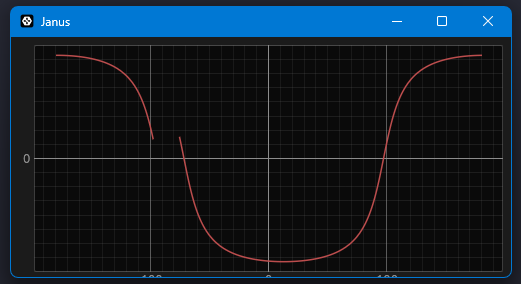

# SGP4 Orbit Propogator

Implementation of the SGP4 from the [NORAD SPACETRACK REPORT NO. 3](https://archive.aoe.vt.edu/cliff/aoe4134/spacetrk.pdf). Turns input data from satellite into a graph representation of where over the earth it is located.

# Sample test case

Test case from SPACETRACK REPORT NO. 3 with inputs and outputs, used to validate SGP4 part of implementation.

## Input values

These are just the ones actually used in the algorithm.

| Variable      | Value         | What it is                        |
| ------------- | ------------- | --------------------------------- |
| EO            | 0.0086731     | Eccentricity                      |
| BSTAR         | 0.000066816   | Drag term                         |
| XINCL         | 72.8435°      | Inclination                       |
| OMEGAO        | 52.6988°      | Argument of perigee               |
| XMO           | 110.5714°     | Mean anomaly                      |
| XNO           | 16.05824518   | Mean motion                       | 
| XNODEO        | 115.9689°     | Right ascension of ascending node |

## Output values

When TSINCE: 0, so the first dot on the graph.

| Variable  | Value         |
| --------- | ------------- |
| X         | 2328.97048951 |
| Y         |-5995.22076416 |
| Z         | 1719.97067261 |
| XDOT      | 2.91207230    |
| YDOT      | -0.98341546   |
| ZDOT      | -7.09081703   |

## Ground track conversion

The X, Y and Z are in ECI format, which can't be displayed on a 2D graph. 

They are converted ECI [-> ECEF](https://space.stackexchange.com/questions/38807/transform-eci-to-ecef) [-> Geodetic](https://en.wikipedia.org/wiki/Geographic_coordinate_conversion#The_application_of_Ferrari's_solution)

## Graph

