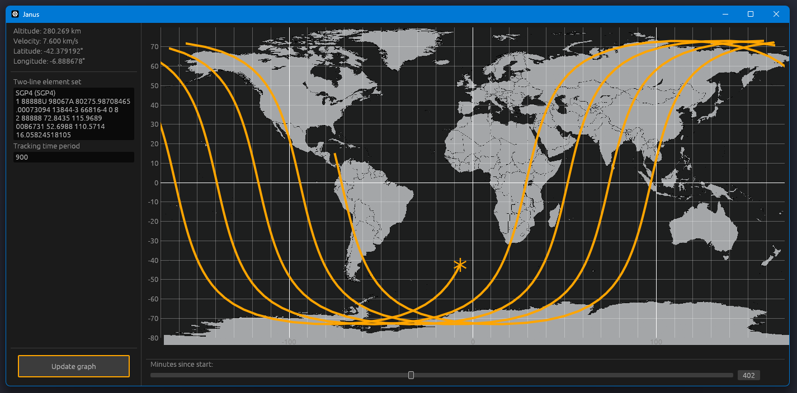

# Orbit Propagator

Implementation of the SGP4 from the [NORAD SPACETRACK REPORT NO. 3](https://archive.aoe.vt.edu/cliff/aoe4134/spacetrk.pdf). Turns input data from satellite into a graph representation of where over the earth it is located.



## SGP4

Calculate where an Earth-orbiting satellite is and where it will be. Takes into account Earth's non-perfect shape & how it affects gravity, atmospheric drag and lunar & solar gravity.

## Ground track conversion

The X, Y and Z are in ECI format, which can't be displayed on a 2D graph. Also takes into account how the globe is converted into a imperfect 2D map.

They are converted ECI [-> ECEF](https://space.stackexchange.com/questions/38807/transform-eci-to-ecef) [-> Geodetic](https://en.wikipedia.org/wiki/Geographic_coordinate_conversion#The_application_of_Ferrari's_solution)


## Sample test case

Test case from SPACETRACK REPORT NO. 3 with inputs and outputs, used to validate SGP4 part of implementation.

### Input

Two-line element set ([TLE](https://celestrak.org/NORAD/documentation/tle-fmt.php))

```
SGP4 (SGP4)
1 88888U 80081S 80275.98708465 .00073094 13844-3 66816-4 0 6
2 88888 72.8435 115.9689 0086731 52.6988 110.5714 16.05824718105
```

### Output values

When TSINCE: 0, so the first dot on the graph.

| Variable  | Value         |
| --------- | ------------- |
| X         | 2328.97048951 |
| Y         |-5995.22076416 |
| Z         | 1719.97067261 |
| XDOT      | 2.91207230    |
| YDOT      | -0.98341546   |
| ZDOT      | -7.09081703   |